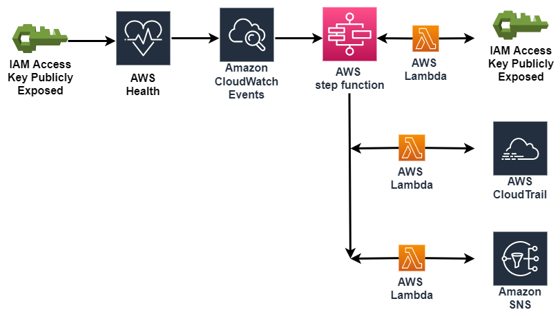

# Suspend the use of exposed AWS keys

此演示了如何使用AWS Step Functions來協調 serverless 的 AWS Lambda workflow ，以回應由AWS Health生成的Amazon CloudWatchEvent。

AWS主動監控流行的 code repository 網站以發現暴露的AWS Identity and Access Management (IAM) access keys，

一旦發現暴露的IAM access key，AWS Health就會生成AWS_RISK_CREDENTIALS_EXPOSED CloudWatch Event，

對該Event的回應，一個自動化的工作流程會禁用暴露的 IAM Access Key，

總結最近暴露的access keys的API活動，並將摘要消息發送到Amazon Simple Notification Service（SNS）Topic，

通知訂閱者-所有這些都是由AWS Step Functions state協調的。




### 架構演練
1. 一個IAM access keys被無意上傳到AWS監控的code repository(GitHub)。
2. AWS Health 檢測到該key, 產生 AWS_RISK_CREDENTIALS_EXPOSED CloudWatch Event，
   AWS還暫時限制了該key，強制套用 AWSCompromisedKeyQuarantine 該 policy 使您不能夠進行API調用
   (iam, ec2,s3,organizations, lambda and lightsail)。

 
 
3. 配置CloudWatch Events rule 匹配此事件，觸發StepFunction流程
    * 禁用外洩的IAM Access Key， 如果這一步有錯誤，則跳到最後一步
    * 總結CloudTrail的user最近的API活動
    * 發送安全通知摘要至` SecurityNotificationTopic` SNS Topic， 如果第一步出現錯誤，則通知安全人員發生錯誤和事件需要人工檢查


## Running the Example


#### Launch the CloudFormation Template Manually 


手動部署模板，則需要目標區域中的 S3 bucket，然後使用 `aws cloudformation package` 應用程序將 Lambda functions打包到該 S3 bucket中


Clone the repository

```bash
git clone
```

Then go to the `cloudformation` folder and use the `aws cloudformation package` utility

```bash
cd cloudformation

aws cloudformation package --region us-east-1 --s3-bucket REPLACE_WITH_YOUR_BUCKET --template risk_credentials_exposed.serverless.yaml --output-template-file risk_credentials_exposed.output.yaml
```
Last, deploy the stack with the resulting yaml (`risk_credentials_exposed.output.yaml`) through the CloudFormation Console or command line:

```bash
aws cloudformation deploy --region us-east-1 --template-file risk_credentials_exposed.output.yaml --stack-name AWSHealthCredsExposed  --capabilities CAPABILITY_NAMED_IAM --region us-east-1
```

## Testing the Example
To test the example without exposing an IAM Access Key to a public repository you can simulate the workflow by executing the `ExposedKey-XXXXXXXXXXXX` state machine with a set of test json for the event. To do this follow the steps detailed below.

Ensure you have at least one E-mail address [subscribed](http://docs.aws.amazon.com/sns/latest/dg/SubscribeTopic.html) to the `SecurityNotificationTopic` created by the template to receive the notification.

1. Go to the [Identity & Access Management](https://console.aws.amazon.com/iam/home) console
1. Go to `Users`
1. Click `Add User` and create a user with programmatic access
    * For the `User name` put `test-user`
    * For `Access type` select `Programmatic access`
    * **Do not set any permissions for the user**
    * Note the `Access key ID` from the Review page for later use in the test json
1. Go to the [Step Functions](https://console.aws.amazon.com/states/home?region=us-east-1#/) console
1. Select the `ExposedKey` state machine
1. Click `New execution` to create the test execution of the state machine
    * Copy and paste the json below to the execution json field
    * Replace `ACCESS_KEY_ID_HERE` with the `Access key ID` noted from the earlier creation of `test-user`
    * You do not need to enter an execution id as one will be randomly generated by default
```json
{
    "version": "0",
    "id": "121345678-1234-1234-1234-123456789012",
    "detail-type": "AWS Health Event",
    "source": "aws.health",
    "account": "123456789012",
    "time": "2016-06-05T06:27:57Z",
    "region": "us-east-1",
    "resources": [],
    "detail": {
        "eventArn": "arn:aws:health:us-east-1::event/AWS_RISK_CREDENTIALS_EXPOSED_XXXXXXXXXXXXXXXXX",
        "service": "RISK",
        "eventTypeCode": "AWS_RISK_CREDENTIALS_EXPOSED",
        "eventTypeCategory": "issue",
        "startTime": "Sat, 05 Jun 2016 15:10:09 GMT",
        "eventDescription": [
            {
                "language": "en_US",
                "latestDescription": "A description of the event will be provided here"
            }
        ],
        "affectedEntities": [
            {
                "entityValue": "ACCESS_KEY_ID_HERE"
            }
        ]
    }
}
```

You can follow the state machine's progress in the Step Functions console. The summary message for `test-user` will be sent to the e-mail address(es) subscribed to the `SecurityNotificationTopic` SNS Topic.

Once you have received the notification e-mail you can return to the IAM console to verify that the key created for `test-user` has been disable.

* **Note that the summary for this user will likely be empty as it will not have logged any API calls to CloudTrail**


## Cleaning Up the Stack Resources

To remove all resources created by this example, do the following:

1. Delete the CloudFormation stack.
2. Delete the CloudWatch log groups associated with each Lambda function created by the CloudFormation stack.

## CloudFormation Template Resources

The following sections explain all of the resources created by the CloudFormation template provided with this example.

### CloudWatch
- **RiskCredentialsExposedRule** - A CloudWatch Events Rule to detect AWS Health AWS_RISK_CREDENTIALS_EXPOSED events and send them to the Step Functions state machine target

### Step Functions
- **ExposedKeysStepFunction** - A Step Functions state machine that orchestrates the access key disable, API call summary, and notification of security

### Lambda
- **DisableAccessKeyPair** - Lambda function that disable the exposed IAM Access Key Pair associated with username provided by event.
- **LookupCloudTrailEvents** - Lambda function that looks up and summarizes recent API activity for the exposed access key provided by the event.
- **NotifySecurity** - Lambda function that constructs and sends security notification message containing API activity summary to SNS Topic created by this CloudFormation template.

### SNS
- **NotificationTopic** - SNS Topic that API activity security message is sent to.

### IAM
- **ExecuteStateMachineRole** - IAM Role with policy that allows CloudWatch Events rule to invoke executions of Step Functions state machines
- **StepFunctionExecutionRole** IAM Role with policy that allows Step Functions state machines to invoke Lambda functions.
- **LambdaDisableAccessKeyPairRole** - IAM Role with policy that allows Lambda function to invoke "iam:UpdateAccessKey" and "iam:GetAccessKeyLastUsed" API calls and write log messages to CloudWatch Logs.
- **LambdaLookupCloudTrailEventsRole** - IAM Role with policy that allows Lambda function to invoke "cloudtrail:LookupEvents" API call and write log messages to CloudWatch Logs.
- **LambdaSnsPublishRole** - IAM Role with policy that allows Lambda function to invoke "sns:Publish" API call and write log messages to CloudWatch Logs.

## reference document

https://github.com/aws/aws-health-tools/tree/master/automated-actions/AWS_RISK_CREDENTIALS_EXPOSED
